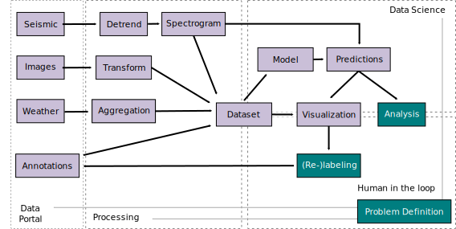
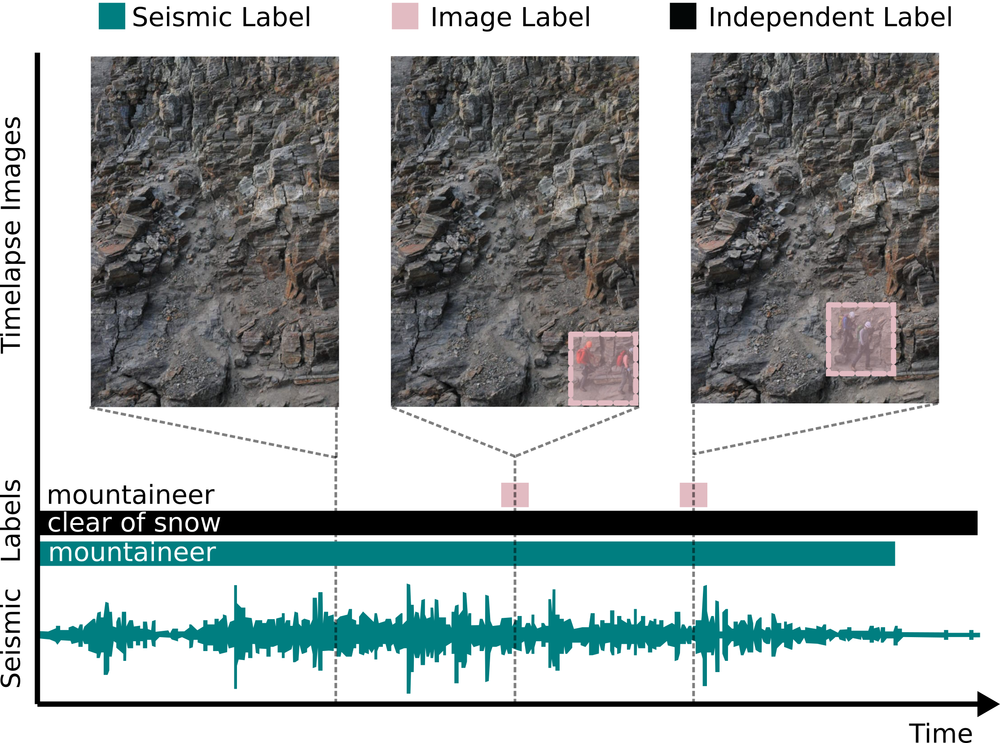

# Concepts

foReal follows a declarative paradigm: To bridge expertise domains it is more relevant to define what is needed (declarative), instead of how it is implemented (imperative). To accomplish a declarative workflow, foReal focuses on configurability, accessbility and reproducability.

We focus on two major concepts: Transparent separation of concerns and declarative data access and processing


## Transparent separation of concerns
In environmental monitoring, a diverse set of tasks need to be performed such as experiment and system design, instrument development, deployment setup and maintenance, data collection and management, algorithm development, model definition and data analysis. These tasks require different expertise which can be found in different domains for example hardware domain (Develop, deploy and maintain wireless sensor network), software domain (efficient data storage, data transfer, data management), application domain (define application scenario, set up experiments, contribute expert knowledge, analyze data) and data domain (find adequate data analysis methods, automate data analysis). Some or all of these domains may be covered by one individual but usually a team is required to accomplish an experiment. 

On the software side, data generation, processing and analysis can be subdivided into multiple components each requiring specific expertise. However, errors in each component may have a strong negative impact on the overall analysis and combatting these errors requires again a very specific set of expertise. Unfortunately, certain types of errors don't necessarily reveal themselves during development of each component but in later stages when all components are combined. 

To address the challenge of a multi-disciplinary data analysis project, we define the following software requirements:

- **Separation of concerns**: Abstraction of a system into *modules* which are each responsible for one specific subtask of the system. Each module can be worked on individually which allows to distribute the work to experts. Each module must receive and provide their data in a common, well-defined format. *Clear interfaces* are necessary to join modules to a functioning system.
- **Transparency**: Each user or developer should be able to trace errors back to their origin in all modules of the system.

Ideally, these requirements are reflected in the analysis workflow and software package. The following illustration highlights a data flow graph for a one environmental analysis example. Each node of the graph represents either a processing unit (light-purple) or a human-lead step (dark-cyan). A data access unit for each respective sensor should be designed to give access to the data and include meta information (for example about data availability, data validity or sensor peculiarities). This unit acts as a bridge translating raw or processed sensor data to a common data shape used for analysis. Next, the data processing is split into well-defined processing units, thus distinguishing functionality and implementation. Each processing unit processes the data and returns it in the common data shape. In the example, seismic, image and weather unit as well as annotations can be used to train a model, which can subsequently be used to create predictions for long-term analysis. Annotation errors can be mitigated by using the visualization tool for relabeling the annotation set. Additionally, the visualization tool can be used to perform analysis.



<b>Data flow graph for an example data analysis. Software components are highlighted in light-purple, human-lead steps in dark-cyan. Data access units bridge sensor data and processing units. By providing the output in a common data shape, multiple units can be concatenated. The output of such concatenations can be combined into a dataset, which can be used for visualization or for developing a model. Finally, the human in the loop can perform analysis or relabeling. Such data flow graphs provide an easy to understand high-level view of a software solution.</b>

The advantage of a data flow graph described is that it can be implemented as a task graph, similar to filter graphs in signal processing, where each node transforms the incoming signal(s) and delivers them to the next node(s) in the graph. Task graphs are easy to understand and use even with little technical expertise. In our framework, graph computation is performed using [dask](https://www.dask.org), a library for parallel computing. The dask framework allows to schedule the graph's tasks in a single thread or parallelize the graph on one or many computers. Thus, we can adopt dask capability of scaling out (using more machines) if our analysis task or dataset grows. Dasks implements computation using a directed acyclic graph. Dask is based on a generic task scheduling and supports complex algorithms and as well as multi-dimensional arrays.

## Declarative Data Access and Data Processing
To bridge expertise domains it is more relevant to define *what* is needed (declarative), instead of *how* it is implemented (imperative). In the case of our motivational example, *what* is needed for analysis is the time-frequency representation of seismic data for a given time period. Ideally, *how* the complex data processing leading to a spectrogram is implemented could be abstracted away and hidden from the data user. To illustrate the complexity, generating a spectrogram would include the development of a program to determine which and how much waveform data is needed to produce a spectrogram of requested size. Then, the software would need to check if the waveform data is available, loading waveform data from disk and transforming it with an efficient implementation of a short-time fourier transformation. It is important to consider that the spectrogram computations uses a sliding window, thus its output dimension is depending on the sliding window parameters (window size and stride). If the waveform duration is not chosen according to these parameters, the spectrogram will not have the desired dimensions. 

Here, a combination of task graph and declarative approach can be beneficial. First, the task graph provides a generic framework for how a spectrogram is computed. Secondly, we could declare which time segment of a spectrogram is requested instead of declaring which time segment of waveform to transform into a spectrogram. A designated spectrogram unit would hide the complexity of choosing the correct waveform duration for the given spectrogram parameterization to generate the spectrogram of requested size.

In foReal a declarative procedure is implemented with so called *requests*, exemplified. A request is a metadata information which contains parameter information for selected units in the task graph. These parameters can for example include, which time period to load, from which seismic station to load the data or which preprocessing parameters to use. Parameters declared in a request can be valid for all processing units in the graph (*global*), for a processing unit type (*types*) or one specific instance of a unit (*keys*). Moreover, it includes parameters which act on data, such as the *indexers* parameter, which contains information about which subset of the requested data segment is relevant.


```
{ 
  "indexers": { 
    "time": {   
      "start": "2017-07-02T10:01:00", 
      "stop": "2017-07-02T10:02:00"},
    "frequency": { 
      "start": 0, 
      "stop": 20},
    "sensor": ["MH36", "MH38"],
    }, 
  "config":{
    "global":{
      "raw":False}
    },
    "types":{
      "SeismicPortal":{"sampling_rate":100}
      },
    "keys":{
      "spectrogram_id":{"stride":1024}
    },
}
``` 

The previous code snipped is an example of a request and its structure. Such a request can be defined by the data user or be the result of a processing unit's configuration function.

- L2 `indexers`: Define which data segment to return 
- L3 `indexers.time`: Select a range on the time dimension 
- L6 `indexers.frequency`: Select a range on the frequency dimension 
- L9 `indexers.sensor`: Select two specific values on the sensor dimension
- L11 `config`: Define global, type-specific or unit-specific configuration. Any key except `global`, `types`, `keys` will be treated as `global`
- L13 `config.global`: Affects every unit with this parameter 
- L16 `config.types`: Affects all units of specified type (SeismicPortal) 
- L19 `config.keys`: Affects the unit with the specified key (`spectrogram_id`)


The following figure and code listing illustrates how a multi-modal data sample is computed using *foReal*. In the figure, a task graph is given which contains a path for computation of a seismic spectrogram and one path aggregating the rain intensity of the last hour. Most of the parameters of each processing unit are predefined during graph design and are not explicitly mentioned in the given requests. The request \#1 is designed to extract one time segment from the task graph. It is propagated towards the *Seismic* and *Weather* data access units. Internally, the *Spectrogram* and *Rain Aggregation* unit update the request with a new start time and forward it. Additionally, the *Rain Aggregation* unit requests only the rain intensity subset, given that the *Weather* unit provides a set of different weather measurements (for example rain intensity, wind speed, ...).


```
1 { "indexers": { 
1    "time": { 
1    "start": "2017-07-02T10:01:00", 
1    "stop": "2017-07-02T10:02:00"}}}
2 { "indexers": { 
2    "time": { 
2    "start": "2017-07-02T10:00:55", 
2    "stop": "2017-07-02T10:02:00"}}}
3 { "indexers": { 
3    "time": { 
3    "start": "2017-07-02T09:02:00", 
3    "stop": "2017-07-02T10:02:00"}}}
```


More generally, configuring a task graph using a request proceeds in two phases, a configuration phase and a computation phase. In the configuration phase, the respective request is propagated through the task graph from sink to source. Each unit receives the request from its successor (in direction towards the sink). Simply put, for every unit the following question must be answered: *"What does this unit need from the previous units to fulfill the given request?"*
This means each unit extracts and verifies from the request the metadata relevant for it. It then adds, modifies or creates requirements it needs from its predecessors. Each unit can also indicate if it requires the updated request in the computation phase again. The updated request is then forwarded to the next unit until all sources of the graph are reached. If nothing is requested from previous units, all previous units (if any) can be removed from the task graph. 
In the second phase, the graph is scheduled for computation, starting from the data access units to the sink units. Each unit receives multiple inputs, including data from the previous unit(s) and the request from the configuration phase. 

As explained before, processing the data can be a complex, error-prone task, especially if the data source is sensitive to errors. The declarative approach can potentially reduce these errors because it provides a clear interface to gather the relevant information. Using a declarative approach allows to disconnect conceptual errors (Is a spectrogram the right choice to analyse my data?) from implementation errors (Is enough waveform data loaded to get the spectrogram of required size?)

## Datasets
In foReal a **dataset** is:

*A task graph combined with a request or set of requests.*

A dataset explicitly includes not only data but also processing steps and thus increases its flexibility to address errors and facilitates reproducibility.

## Data Independence 
foReal's declarative approach abstracts the physical data acquisition (vibration registered by a sensor and digitized) into a logical data access pattern (request signal from time $t_0$ to time $t_1$). Similarly, we want to abstract the physical data model (for example a file stored in a filesystem on hard disk) into an easy to understand logical data model (for example a table). This abstraction is usually referred to as data independence.
 
Focusing on data models is crucial in long-term monitoring projects since data from such projects is ever evolving. Over the course of a long-term measurement, changes in file formats or storage engines are likely. Moreover, changes in data types can occur when for example new sensors are installed. 

The foReal framework is designed to work with specific logical data models for data and annotations which will be described in the following.


## Data Cubes

Environmental data is inherently multi-dimensional. Examples include 

 - time-series (1-dimension: time)
 - seismic spectrograms (2-dimensions: time,frequency)
 - images (3-dimensions: x, y, color)
 - timelapse images (4-dimensions: time,x,y,color)
 - seismic spectrograms in global context (7-dimensions: latitude,longitude,elevation,station,channel,time,frequency)

The logical data model for these kind of data are typically multi-dimensional arrays or so-called data cubes. In environmental monitoring, often the data along a dimension is meaningless without additional information, such as timestamps for the time dimension, frequency steps for the frequency dimension, or coordinates for spatial data. Therefore, data cubes for environmental data require the option of additional one dimensional arrays (from here on called coordinates) describing the content along each dimensions. These so-called labeled multi-dimensional arrays are implemented efficiently in the [xarray](https://xarray.dev/) framework, which is used internally by foReal.

foReal's request-driven data access is grounded in data cubes. A request in  foReal slices out a segment of a multi-dimensional data cube using coordinates to select the requested data segment.

## Annotations

We want to achieve data independence for annotations, meaning instead of defining annotations by their representation in the physical data storage (name of the folder containing images of respective label) we want to abstract it into a logical data model (directive to connect data with a label). This requirement comes from the fact, that the we need to be able to restructure or resample the data without loosing the annotation information. For examples if the annotations are stored as folder names (as done for certain image datasets) they are attached to the storage structure (filesystem). When we change the storage system or just restructure the data by sorting it differently the annotations information might be lost. Moreover, annotation should be reusable and independent of data type. If we, for example, annotate wind in a time-series stream, we should in principle be able to apply this annotation to a co-located seismic sensor.

In foReal, annotation can be connected to the respective data by using a similar approach as used for *requests} in the previous section.  Like a request, annotation contain an *indexers} key defining the concrete slice of data to be annotated. In addition, it contains a *tags} key containing the annotation. We do not put harsh constraints on what a target is but usually it would be the class name of the annotated event. The annotation might additionally contain more information such as how or by whom the annotation was created or an event id to trace and track multiple annotations of the same event, for example to annotate the same mountaineer on multiple, consecutive timelapse images.
The annotation format is exemplified in the following figure using images and seismic data. The figure shows graphically which segment of the image or seismic stream is annotated. In addition, three annotations are given in JSON format.


```
{ "indexers": {
    "time": { 
      "start": "2016-08-04T11:44:17", 
      "stop": "2016-08-04T12:09:32"}, 
    "sensor": ["MH36", "MH38"]}, 
  "tags": {"mountaineer": true}}
...
{ "indexers": {  
    "time": ["2016-08-12:04:12"], 
    "x": { 
      "start": 95, 
      "stop": 145},
    "y":{ 
      "start": 20, 
      "stop": 70}, 
    "sensor": ["MHDSLR"]},
  "tags": {"mountaineer": true}}
...
{ "indexers": {
    "time": {
      "start": "2016-05-02", 
      "stop": "2016-09-15"}, 
    }, 
  "tags": {
    "clear of snow": {"annotator":"mountain-lodge keeper"}}}
...
```

---


<b>Sensor-specific label or sensor-independent annotation can be described using the same syntax. *indexers* describes the actual data slice to be annotated. *tags* contains the annotation.</b>


 foReal annotations can be used for two purposes. First, a given annotation can be used to load the corresponding data segment. Second, a given data segment can be annotated with the corresponding annotation(s). 


---

<b>Usage of annotations in the context of foReal. The request's start and end time are highlighted as the red line below the signals. In **a)** an annotation is used as a request to load the corresponding seismic segment. In **b)** a request from a dataset is used to load a seismic segment and all corresponding annotations. The upper path in **b)**} demonstrates how a request (one red line), which can be regarded as a one-dimensional "bounding box", overlaps with the annotation's one-dimensional "bounding boxes" (three black lines).</b>

Part a) in the above figure depicts how an annotation can be used to load a data segment. Since each annotation contains the same information as a request, it can be used as-is to request the annotated data segment. Moreover, it can be used to retrieve correlated sensor values. For example, we can use the seismic annotation to request all correlated images by replacing the annotation's *sensor* field with the sensor name of the camera.

Annotating a given data segment with annotations is a common scenario, for example when multiple mountaineers are annotated on an image and we want to crop the image while retaining the annotations within the cropped are and discard the annotations which are outside. This scenario is more complex because we need to be able to find the annotations describing a data segment of arbitrary size. 

In our framework, the data segment can be defined by a request. A request can be regarded as bounding box. For the case of a one-dimensional time series, the "bounding box" would consist of start and end time. For the case of a cropped image, the bounding box would consist of the cropping area (start and end values on both, horizontal and vertical axis). In general, a request can be regarded as a multi-dimensional axis-aligned bounding box, which means it consist of a start and end value for each dimension of the array. Similarly, an annotation can be seen as such a bounding box. It describes what (event, object, ...) is inside the bounding box area. 

The task is to find all annotations of the annotation set which are within the request's boundaries, meaning we need to find all annotation bounding boxes that overlap with the request bounding box (illustrated in the top path of the above fiugure part b) ). We implement the multi-dimensional overlap detection iteratively by first checking for overlap on the first dimension between request and annotation set. The other dimensions will only be checked for the pairs with an overlap in the first dimension.
Conceptually, the way a request slices out an annotation segment out of an annotation set is similar to the way a request slices a data segment out of the data cube as illustrated at the bottom of part b) in the above figure.

